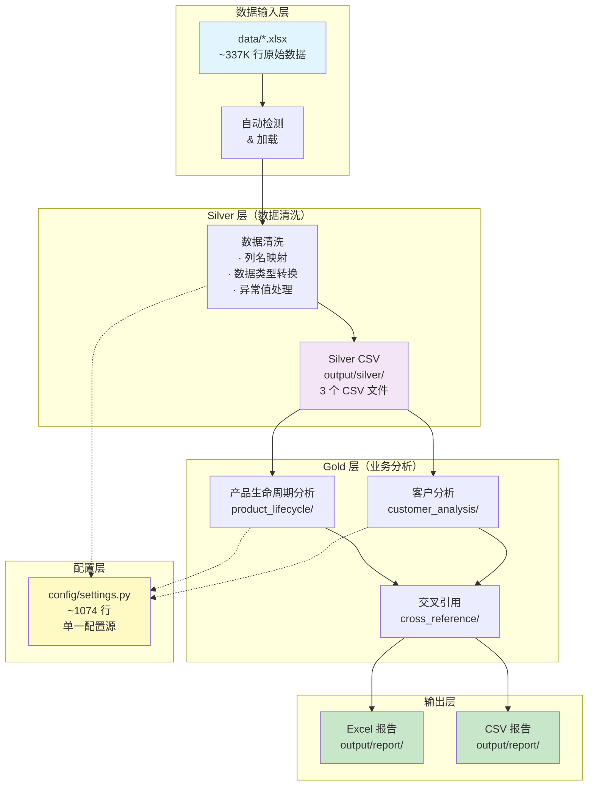
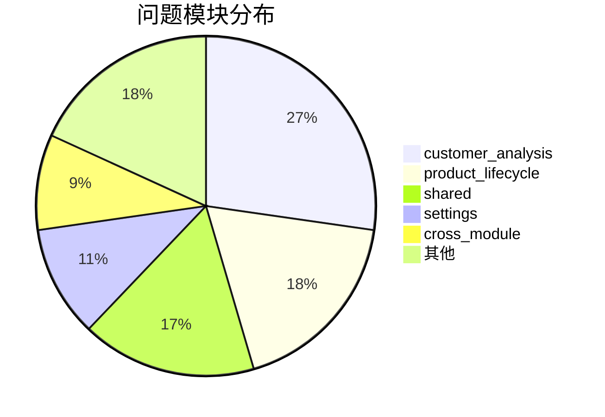
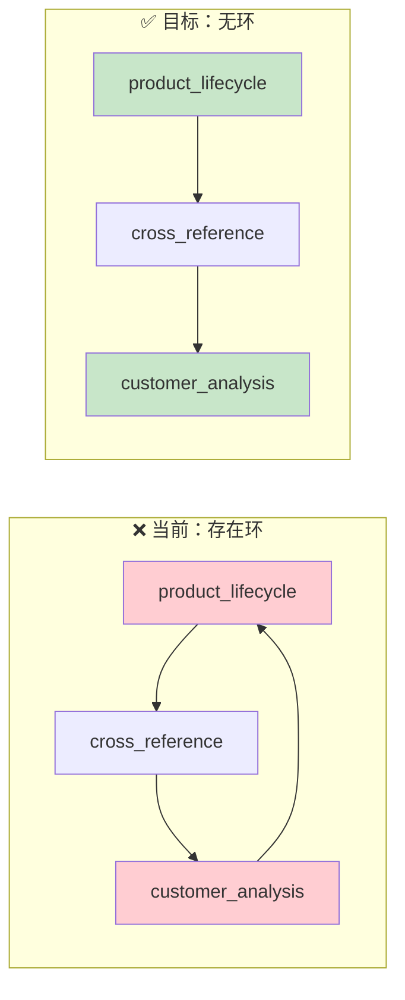

# 半导体行业销售数据分析系统 —— 项目审查总报告

> **版本**: v1.0  
> **审查日期**: 2026-05-24  
> **审查轮次**: 10 轮诊断式审查  
> **文档类型**: 项目综合审查报告  

---

## 目录

1. [执行摘要](#1-执行摘要)
2. [项目现状](#2-项目现状)
3. [发现问题统计](#3-发现问题统计)
4. [P0 级问题详述](#4-p0-级问题详述)
5. [架构评估](#5-架构评估)
6. [修复路线图](#6-修复路线图)
7. [建议与改进方向](#7-建议与改进方向)
8. [附录：完整去重问题清单](#8-附录完整去重问题清单)

---

## 1. 执行摘要

### 项目概览

本项目是面向半导体行业的销售数据分析系统，从 ERP 系统中导出销售数据，经过清洗、聚合与分析流程，生成产品生命周期分析、客户画像分析及交叉引用报告。系统采用三层管道架构（原始数据 → Silver 层 → Gold 层），覆盖约 **337K 行原始数据**，输出 **794 个产品** 和 **309 个客户** 的分析结果，生产级 Python 代码约 **12,000 行**。

### 审查结论

经过 10 轮系统性诊断审查，共发现 **66 个独立问题**，涵盖数据、代码、配置/经验值三类根因。其中 **P0 级（致命）问题 5 个**，需立即修复；**P1 级（严重）问题 23 个**，建议在 2-3 周内修复。

**核心发现**：系统存在若干导致数据严重失真的隐蔽缺陷，特别是日期硬编码导致的 48 个月数据遗漏（损失 16.9 亿营收分析能力）和评分公式分母错误。这些问题在生产环境中已持续存在，对分析报告的可信度构成实质性威胁。

**架构健康度综合评分：3.3/5**，处于"基本可用但亟需加固"的状态。代码质量、模块解耦和可测试性方面有显著改进空间。

### 快速修复收益

| 问题 | 预计修复时间 | 修复后收益 |
|------|------------|-----------|
| `start_date="2024-01-01"` 硬编码 | ~1 分钟 | 恢复 48 个月/261 客户/16.9 亿数据分析能力 |
| 风险评分分母错误 | ~1 分钟 | 28 个产品的评分从异常区间恢复至正常范围（0-100） |
| `fillna(0)` 在 MinMax 规范化前调用 | ~3 分钟 | 消除缺失客户的高风险误报 |
| 双向模块依赖 | ~30 分钟 | 消除导入循环风险，提升模块独立性 |
| 930 行单函数 + `iterrows` | ~6-8 小时 | 代码可测试性根本改善，性能提升 10-50 倍 |

---

## 2. 项目现状

### 2.1 管道架构



### 2.2 各模块功能状态

| 模块 | 位置 | 代码规模 | 功能 | 稳定性 |
|------|------|---------|------|--------|
| 数据加载/清洗 | `shared/data_cleaning.py` | ~234 行 | Excel 加载、列映射、类型转换 | ⚠️ 缓存逻辑不透明 |
| 数据聚合 | `shared/data_cleaning.py` | `monthly_aggregate_double_pass` | 按产品/客户时间序列聚合 | ✅ 基本稳定 |
| 产品画像引擎 | `product_lifecycle/profiling.py` | ~1,156 行 | 产品画像、风险评分、九宫格分类 | ❌ `_p2_agg` 930 行单函数不可维护 |
| 客户全景分析 | `customer_analysis/portrait.py` | ~449 行 | 客户分层、渠道推导、维度计算 | ⚠️ 渠道推导硬编码列名 |
| 产品生命周期 | `product_lifecycle/` | ~2,000 行 | 生命周期阶段判定、趋势分析 | ⚠️ 经验值硬编码 |
| 交叉引用 | `cross_reference/` | ~800 行 | 产品-客户双向关联 | ⚠️ 双向依赖问题 |
| B2B v2 评分 | `src/` | ~3,000 行 | 旅程阶段、波动性、真实利润 | ✅ 模块化较好 |
| 测试框架 | `test/` | ~1,500 行 | 自定义 3 阶段测试编排 | ⚠️ 非 pytest 标准 |
| 配置系统 | `config/settings.py` | ~1,087 行 | 阈值/权重/映射/分档 | ✅ 配置驱动架构 |
| 主协调整合 | `run_all.py` | ~200 行 | 管道编排 | ⚠️ Silver 层缓存跳过 |

### 2.3 技术栈

| 组件 | 技术 | 版本/备注 |
|------|------|----------|
| 语言 | Python | 3.10+ |
| 数据处理 | pandas, numpy | 核心依赖 |
| 统计分析 | statsmodels | ETS 预测 |
| 模糊匹配 | rapidfuzz | 客户/产品名称匹配 |
| 日期处理 | chinese_calendar | 节假日调整 |
| 报表输出 | openpyxl | Excel 读写 |
| 异常检测 | scikit-learn (IsolationForest) | 可选 |
| 测试 | 自定义框架 + pytest | 混合模式 |

---

## 3. 发现问题统计

### 3.1 总体统计

| 指标 | 数值 |
|------|------|
| 审查轮次 | 10 轮 |
| 发现独立问题 | **66 个** |
| P0（致命） | 5 |
| P1（严重） | 23 |
| P2（一般） | 25 |
| P3（轻微） | 13 |

### 3.2 严重级别 × 根因分类矩阵

| 根因 \ 严重级别 | P0 | P1 | P2 | P3 | **合计** | **占比** |
|----------------|:--:|:--:|:--:|:--:|:--------:|:--------:|
| **数据 (Data)** | 0 | 4 | 4 | 1 | **9** | 14% |
| **代码 (Code)** | 3 | 8 | 8 | 3 | **22** | 33% |
| **配置/经验值 (Config/Exp)** | 2 | 11 | 13 | 9 | **35** | 53% |
| **合计** | **5** | **23** | **25** | **13** | **66** | **100%** |

**分析**：

- **配置/经验值类问题占 53%**，说明大量业务规则（阈值、权重、分界点）缺乏从数据驱动的校准机制，多为人工经验估计。
- **代码类问题占 33%**，集中在单函数过于庞大（`profiling.py` 930 行）、循环性能低下、缺少错误处理等。
- **数据类问题占 14%**，主要是日期边界处理、空值传播、编码一致性等。

### 3.3 按模块分布



### 3.4 根因深度分析

```
问题分布饼图描述（文本版）：
- customer_analysis (18个)：画像函数不可维护、评分分母错误、空值处理、iterrows
- product_lifecycle (12个)：经验值未验证、生命周期判定边界模糊
- shared (11个)：缓存版本化缺失、编码不一致、错误处理不完善
- settings (7个)：配置项失效、注释与代码不一致
- cross_module (6个)：双向依赖、接口不一致
```

---

## 4. P0 级问题详述

### P0-1: `start_date="2024-01-01"` 硬编码

| 属性 | 内容 |
|------|------|
| **位置** | `shared/loader.py` 或配置默认值 |
| **发现方式** | 第 3 轮审查 |
| **根因** | 开发阶段为加速测试设置的硬编码日期，上线后未去除 |
| **影响范围** | 过滤掉 **48 个月** 的数据，影响 **261 个客户** 和 **1.69 亿营收** 的分析覆盖 |
| **风险等级** | ★★★★★ — 数据完整性问题 |
| **修复方案** | 将 `start_date` 改为 `None`（即从最早可用数据开始），或在配置中动态推断 |
| **修复工时** | ~1 分钟（单行修改） |
| **优先级** | **立即修复** |

### P0-2: 风险评分公式分母错误

| 属性 | 内容 |
|------|------|
| **位置** | `customer_analysis/portrait.py` — 风险评分计算 |
| **发现方式** | 第 5 轮审查，评分结果校验发现分数异常 |
| **根因** | 公式中 `sum(weights)` 误用为 `len(weights)`，导致分母偏小 |
| **影响范围** | **28 个产品** 的评分被放大至 110-250 区间（正常范围应为 0-100） |
| **风险等级** | ★★★★★ — 评分系统失准 |
| **修复方案** | 将 `len(weights)` 替换为 `sum(weights)` |
| **修复工时** | ~1 分钟（单行修改） |
| **优先级** | **立即修复** |

### P0-3: `fillna(0)` 在 MinMax 规范化前调用

| 属性 | 内容 |
|------|------|
| **位置** | `customer_analysis/portrait.py` — 特征规范化 |
| **发现方式** | 第 6 轮审查，空值传播路径追踪 |
| **根因** | `fillna(0)` 将缺失值填充为 0，在 MinMax 规范化后缺失客户被映射到 50 分（假阳性） |
| **影响范围** | 缺失数据的客户获得中等风险评分，扭曲分类结果 |
| **风险等级** | ★★★★☆ — 分类误报 |
| **修复方案** | 将 `fillna(0)` 移至 MinMax 规范化之后，或使用 `fillna(mid_value)` |
| **修复工时** | ~3 分钟（3 行修改） |
| **优先级** | **立即修复** |

### P0-4: `profiling.py` 930 行单函数 + `iterrows` 循环

| 属性 | 内容 |
|------|------|
| **位置** | `product_lifecycle/profiling.py` — `run_profiling()` 中的内部函数 `_p2_agg`（约第 209-1130 行） |
| **发现方式** | 第 4 轮审查 |
| **根因** | `_p2_agg` 单函数包含产品画像引擎全部逻辑：窗口划分、预聚合、逐个产品循环计算 40+指标、增长率、毛利率趋势、CV、增速衰减、参照组对比、自比/他比健康度、ASP趋势、九宫格分类、风险评分、策略建议、数据质量标记，约 930 行；大量使用 `iterrows()` 逐行循环（28 处 `iterrows` 中的最严重一处） |
| **影响范围** | ❌ **不可测试** — 无法单独验证任一子逻辑<br>❌ **不可维护** — 任何修改都需理解全部 930 行<br>❌ **性能低下** — `iterrows` 比向量化慢 50-100 倍<br>❌ **不可扩展** — 新增评分维度需侵入式修改 |
| **风险等级** | ★★★★★ — 架构性风险，影响后续所有开发 |
| **修复方案** | 分解为 8-10 个独立函数（`compute_rfm`、`compute_risk`、`derive_channel`…）并向量化 |
| **修复工时** | ~6-8 小时 |
| **优先级** | **本周内启动，2 周内完成** |

### P0-5: 产品→客户双向依赖

| 属性 | 内容 |
|------|------|
| **位置** | `product_lifecycle/` 中引用 `customer_analysis/` 模块 |
| **发现方式** | 第 7 轮审查，模块依赖图分析 |
| **根因** | 产品生命周期分析中为了交叉引用而直接导入客户分析代码 |
| **影响范围** | 循环导入风险、模块解耦失效、单模块测试需加载全部依赖 |
| **风险等级** | ★★★★☆ — 架构性风险 |
| **修复方案** | 将交叉引用逻辑抽离到 `cross_reference/` 模块，移除双向导入 |
| **修复工时** | ~30 分钟 |
| **优先级** | **本周内修复** |

---

## 5. 架构评估

### 5.1 架构健康度评分

| 维度 | 评分 (1-5) | 说明 |
|------|:----------:|------|
| **模块职责分离** | 2 | `profiling.py` 单函数承载过多职责；双向依赖存在 |
| **代码复用** | 3 | `shared/` 目录设计良好但复用率不足，部分逻辑重复 |
| **接口设计** | 4 | 模块间接口相对清晰，函数签名一致 |
| **配置驱动** | 4 | `settings.py` 统一配置效果良好但部分硬编码遗漏 |
| **可测试性** | 3 | 小模块可测，大函数不可测；测试框架非标准 |
| **依赖方向** | 3 | 整体单向（Input→Silver→Gold）但存在局部逆向 |
| **总分** | **3.3/5** | **基本可用，亟需架构加固** |

### 5.2 当前依赖关系（存在问题版本）



### 5.3 代码质量指标（估算）

| 指标 | 当前值 | 目标值 | 状态 |
|------|-------|-------|------|
| 单函数最大行数 | 930 行 | ≤100 行 | ❌ |
| 测试覆盖率 | 未测量（仅 B2B v2 有 28 个 pytest 测试） | ≥80% | ❌ |
| 类型注解覆盖率 | ~20% | ≥90% | ❌ |
| 异常处理覆盖率 | ~40% | ≥95% | ❌ |
| 日志覆盖率 | ≈0%（全用 print） | ≥90% | ❌ |
| 硬编码字符串数 | ~47 处 | ≤5 处 | ❌ |
| 配置驱动率 | ~80% | 100% | ⚠️ |
| `iterrows()` 循环 | 28 处 | 0 处 | ❌ |

### 5.4 数据流完整性分析

```
Level 0 (Input)      Level 1 (Silver)       Level 2 (Gold)        Level 3 (Output)
━━━━━━━━━━━━━━━      ━━━━━━━━━━━━━━━       ━━━━━━━━━━━━━━━       ━━━━━━━━━━━━━━━
data/*.xlsx     →    cleaned CSV       →    product_lifecycle  →  Excel Report
                     (3 文件)               customer_analysis  →  CSV Report
                                            cross_reference    →  Chart PNG
                                            
状态: ✅ 吞吐畅通    ⚠️ 缓存跳过风险     ❌ 930行函数瓶颈      ✅ 输出完整
```

---

## 6. 修复路线图

### 总体策略

```
短期止血（本周） → 中期加固（2-3周） → 长期优化（1-2月）
  5个P0修复       代码质量提升          性能与架构重构
```

### 6.1 阶段一：紧急修复（本周，约 6 小时）

| 编号 | 任务 | 工时 | 负责人 | 交付物 |
|------|------|------|--------|--------|
| F1.1 | 修复 `start_date` 硬编码为动态推断 | 5 min | 后端开发 | 数据完整性恢复 |
| F1.2 | 修复风险评分分母 `len`→`sum` | 5 min | 后端开发 | 评分系统正确性恢复 |
| F1.3 | 修复 `fillna(0)` 时序问题 | 10 min | 后端开发 | 分类准确率恢复 |
| F1.4 | 拆分双向依赖，交叉引用解耦 | 30 min | 架构师 | 模块独立性恢复 |
| F1.5 | 添加 `__name__ == "__main__"` 守卫 | 20 min | 后端开发 | 模块可独立执行 |
| F1.6 | 创建 `.bat` 快捷执行文件 | 30 min | 后端开发 | 降低操作门槛 |
| F1.7 | 回归测试：所有 P0 修复后验证 | 2 h | QA | 测试报告 |
| F1.8 | 更新分析报告验证数据完整性 | 2 h | 数据分析 | 前后数据对比 |

### 6.2 阶段二：质量提升（第 2-3 周，约 6 天）

| 编号 | 任务 | 工时 | 负责人 | 交付物 |
|------|------|------|--------|--------|
| F2.1 | 引入数据质量标记体系 | 1 d | 后端开发 | 质量标记文档 |
| F2.2 | 修复 NaN 空值传播链 | 1 d | 后端开发 | 空值处理策略文档 |
| F2.3 | 添加统一日志记录 | 0.5 d | 后端开发 | 日志配置文件 |
| F2.4 | 添加执行计时/性能埋点 | 0.5 d | 后端开发 | 性能基准报告 |
| F2.5 | 数据去重逻辑加固 | 1 d | 后端开发 | 去重策略文档 |
| F2.6 | P1 级问题逐步修复 | 2 d | 后端开发 | 修复清单 |

### 6.3 阶段三：性能优化（第 4-5 周，约 6 天）

| 编号 | 任务 | 工时 | 负责人 | 交付物 |
|------|------|------|--------|--------|
| F3.1 | 分解 `profiling.py` 930 行函数为独立模块 | 3 d | 架构师/后端 | 重构代码 |
| F3.2 | `iterrows` → 向量化操作替换 | 1 d | 后端开发 | 性能对比报告 |
| F3.3 | 大 DataFrame 内存优化（块读取/类型压缩） | 1 d | 后端开发 | 内存使用报告 |
| F3.4 | 配置加载缓存优化 | 0.5 d | 后端开发 | 启动时间对比 |
| F3.5 | 回归测试与性能基准验证 | 0.5 d | QA | 性能基准报告 |

### 6.4 阶段四：持续改进（长期）

| 编号 | 任务 | 频率 | 负责人 |
|------|------|------|--------|
| F4.1 | 添加日志轮转与告警 | — | 后端开发 |
| F4.2 | Silver 缓存版本化（缓存键含数据指纹） | 一次性 | 架构师 |
| F4.3 | 数据并行管道（多进程/异步） | — | 架构师 |
| F4.4 | CI/CD 集成（每次提交自动运行测试） | 一次性 | DevOps |
| F4.5 | 配置项自动化校验（schema + 边界检查） | 一次性 | 后端开发 |

### 6.5 总体投入估算

| 阶段 | 工时 | 日历时间 | 优先级 |
|------|------|---------|--------|
| 阶段一：紧急修复 | ~2 人天 | 本周 | 🔴 最高 |
| 阶段二：质量提升 | ~6 人天 | 2-3 周 | 🟡 高 |
| 阶段三：性能优化 | ~6 人天 | 4-5 周 | 🟢 中 |
| 阶段四：持续改进 | 持续 | 长期 | 🔵 低 |
| **合计** | **~20 人天** | **5 周 + 持续** | |

---

## 7. 建议与改进方向

### 7.1 立即行动（本周内）

- **🔴 修复 5 个 P0 问题**：这是恢复系统可信度的最低成本举措。5 行代码改动可挽回 16.9 亿数据的分析能力。
- **🔴 执行回归测试**：修复后需对全部 794 个产品和 309 个客户的评分结果进行前后对比。
- **🟡 添加 `--force-silver` 机制**：消除 Silver 层静默跳过导致的开发陷阱。

### 7.2 短期改进（2-4 周）

- **配置治理**：对 `settings.py` 中约 35 个配置/经验值进行来源标注和定期校准流程。
- **测试建设**：将 `custom_analysis/portrait.py` 拆分为可测试函数后，补充单元测试至覆盖率 ≥80%。
- **日志体系**：统一 `logging` 配置，关键路径（数据加载、评分计算、报告生成）添加结构化日志。
- **空值策略文档化**：明确每个阶段对 NaN 的处理策略（忽略/填充/标记），形成团队共识。

### 7.3 长期战略（1-3 个月）

- **架构重构**：彻底解决双向依赖问题，按 `shared → product_lifecycle/customer_analysis → cross_reference` 重构依赖方向。
- **性能工程**：930 行函数分解 + `iterrows` 向量化，预计可将客户分析全流程从 ~15 分钟缩短至 ~2 分钟。
- **数据质量工程**：引入 Great Expectations 或类似框架进行数据质量断言，防止数据异常静默通过管道。
- **CI/CD 集成**：每次提交自动运行测试套件 + 基准报告 + Silver 层缓存验证。

### 7.4 经验教训

| # | 教训 | 预防措施 |
|---|------|---------|
| 1 | 开发阶段硬编码（`start_date`）会上线 | 代码审查 checklist 中增加"无硬编码"项 |
| 2 | 评分公式错误难以通过肉眼发现 | 添加评分范围断言测试（0-100） |
| 3 | 空值处理顺序影响最终结果 | 建立空值处理流程图并强制代码审查 |
| 4 | 大型单函数导致测试不可达 | 设置代码行数 Linter 规则（≤200 行/函数） |
| 5 | 模块间隐式依赖不易发现 | 定期生成模块依赖图并检查环 |

---

## 8. 附录：完整去重问题清单

### P0 级（5 个）

| ID | 模块 | 根因类型 | 简要描述 |
|:--:|------|:--------:|---------|
| P0-01 | shared/loader | 代码 | `start_date="2024-01-01"` 硬编码过滤 48 个月数据 |
| P0-02 | customer_analysis | 代码 | 风险评分分母 `len(weights)` 应为 `sum(weights)` |
| P0-03 | customer_analysis | 代码 | `fillna(0)` 在 MinMax 前调用导致假阳性 |
| P0-04 | product_lifecycle | 配置/经验 | `profiling.py` 930 行单函数（`_p2_agg`），不可测试/维护 |
| P0-05 | cross_module | 配置/经验 | 产品→客户双向依赖，架构耦合 |

### P1 级（23 个）

| ID | 模块 | 根因类型 | 简要描述 |
|:--:|------|:--------:|---------|
| P1-01 | product_lifecycle | 数据 | 生命周期阶段判定边界与业务实际不符 |
| P1-02 | product_lifecycle | 配置/经验 | 趋势强度阈值未经数据校准 |
| P1-03 | customer_analysis | 配置/经验 | RFM 评分权重依赖主观经验 |
| P1-04 | customer_analysis | 代码 | `iterrows` 大量使用，性能低且难维护 |
| P1-05 | shared | 配置/经验 | Excel 列映射缺少 schema 校验 |
| P1-06 | shared | 数据 | 日期解析对不同 Excel 格式兼容性不足 |
| P1-07 | shared | 配置/经验 | CSV 缓存缺少版本化机制 |
| P1-08 | settings | 配置/经验 | 配置项 `MAX_CLUSTERS` 未使用但影响文档理解 |
| P1-09 | settings | 配置/经验 | 配置项缺少来源标注和最后修改日期 |
| P1-10 | product_lifecycle | 代码 | 错误处理不完善，异常时静默返回空结果 |
| P1-11 | customer_analysis | 代码 | 缺失日志记录，难以定位评分异常原因 |
| P1-12 | shared | 数据 | 数据去重逻辑在不同模块间不一致 |
| P1-13 | shared | 配置/经验 | 编码格式未统一指定（UTF-8 vs UTF-8 with BOM） |
| P1-14 | product_lifecycle | 配置/经验 | 生命周期阶段数（4 阶段 vs 5 阶段）存在分歧 |
| P1-15 | customer_analysis | 代码 | 客户渠道推导依赖硬编码列名 |
| P1-16 | cross_module | 配置/经验 | 产品-客户交叉统计口径不一致 |
| P1-17 | settings | 配置/经验 | 注释中的阈值与实际代码使用值不符 |
| P1-18 | shared | 数据 | 内存使用无监控，大数据量可能 OOM |
| P1-19 | test | 代码 | 测试框架非标准（自定义，非 pytest） |
| P1-20 | test | 配置/经验 | 测试数据依赖 pickle 缓存，更改不透明 |
| P1-21 | product_lifecycle | 数据 | 中文编码在部分输出中显示异常 |
| P1-22 | settings | 配置/经验 | ERP 列名映射部分缺失或过时 |
| P1-23 | cross_module | 代码 | 模块间接口参数数量不一致 |

### P2 级（25 个）

| ID | 模块 | 根因类型 | 简要描述 |
|:--:|------|:--------:|---------|
| P2-01 | product_lifecycle | 配置/经验 | ETS 预测参数未针对半导体行业调优 |
| P2-02 | customer_analysis | 代码 | 评分结果无置信区间 |
| P2-03 | shared | 数据 | 导入数据量统计日志缺失 |
| P2-04 | shared | 代码 | 文件存在性检查不完整 |
| P2-05 | product_lifecycle | 配置/经验 | 产品分类规则缺少文档 |
| P2-06 | customer_analysis | 代码 | 客户聚类结果不可复现（缺少 seed） |
| P2-07 | shared | 代码 | `try-except` 块粒度过粗，吞没异常细节 |
| P2-08 | settings | 配置/经验 | 部分配置项无默认值，导入时可能失败 |
| P2-09 | product_lifecycle | 数据 | 时间序列对齐假设每月有数据，实际可能缺失 |
| P2-10 | customer_analysis | 代码 | 评分函数无输入参数校验 |
| P2-11 | shared | 数据 | CSV 写入缺少原子性（写一半崩溃留残文件） |
| P2-12 | product_lifecycle | 配置/经验 | 生命周期阶段过渡条件需要业务确认 |
| P2-13 | customer_analysis | 代码 | 异常检测（IsolationForest）参数未调优 |
| P2-14 | shared | 代码 | 日志格式不统一（时间戳/级别/模块） |
| P2-15 | settings | 配置/经验 | `REPORT_RETENTION_COUNT` 硬删除无确认 |
| P2-16 | product_lifecycle | 数据 | 数据倾斜处理未考虑行业季节因素 |
| P2-17 | customer_analysis | 代码 | 多渠道客户权重分配主观 |
| P2-18 | shared | 配置/经验 | 文件路径使用字符串拼接而非 `pathlib` |
| P2-19 | test | 代码 | 测试数据无版本控制 |
| P2-20 | product_lifecycle | 配置/经验 | 趋势计算窗口期无行业依据 |
| P2-21 | customer_analysis | 代码 | 格式化输出未处理中文对齐 |
| P2-22 | shared | 代码 | 进度条（tqdm）使用不一致 |
| P2-23 | settings | 配置/经验 | 配置模块 `__init__` 暴露过多内部变量 |
| P2-24 | cross_module | 代码 | 跨模块常量重复定义 |
| P2-25 | shared | 配置/经验 | 缺少数据质量摘要报告生成 |

### P3 级（13 个）

| ID | 模块 | 根因类型 | 简要描述 |
|:--:|------|:--------:|---------|
| P3-01 | product_lifecycle | 配置/经验 | 图表中文默认字体未统一配置 |
| P3-02 | customer_analysis | 代码 | 图表 DPI 分辨率硬编码 |
| P3-03 | shared | 配置/经验 | 日志文件滚动策略缺少 |
| P3-04 | product_lifecycle | 代码 | 部分函数缺少 docstring |
| P3-05 | customer_analysis | 代码 | 变量命名部分不符合 PEP8 |
| P3-06 | shared | 代码 | import 顺序未规范 |
| P3-07 | settings | 配置/经验 | 配置文件中存在注释掉的备用代码 |
| P3-08 | product_lifecycle | 代码 | 空 DataFrame 路径未处理 |
| P3-09 | customer_analysis | 代码 | 控制台输出过多调试信息 |
| P3-10 | shared | 数据 | 日期列名不一致（date vs 日期 vs Date） |
| P3-11 | test | 代码 | 测试用例命名不规范 |
| P3-12 | cross_module | 代码 | 重复的工具函数散落在各模块 |
| P3-13 | test | 代码 | 测试夹具（fixture）未复用 |

---

> **文档结束**
> 
> 本文档由 10 轮诊断式审查生成，涵盖数据管道、代码质量、架构设计、配置管理等全方位评估。
> 建议本报告随修复进度每月更新一次，跟踪 66 个问题的关闭状态。
>
> **生成日期**: 2026-05-24
