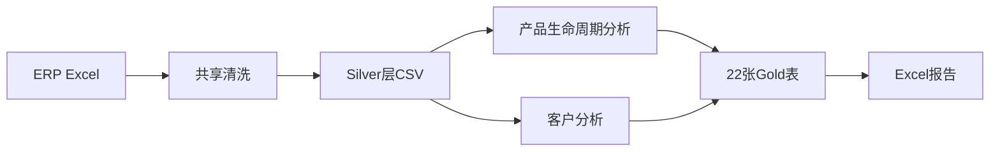
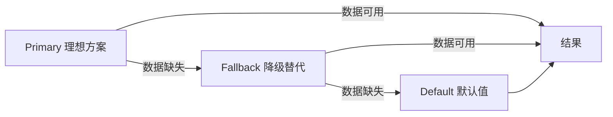
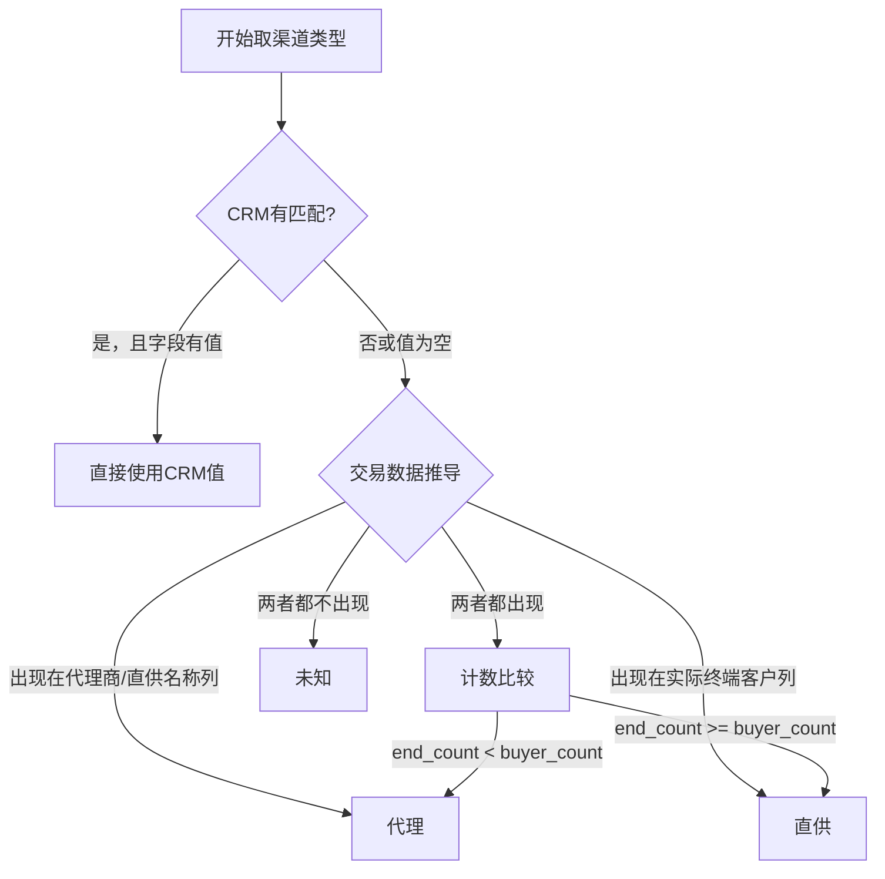
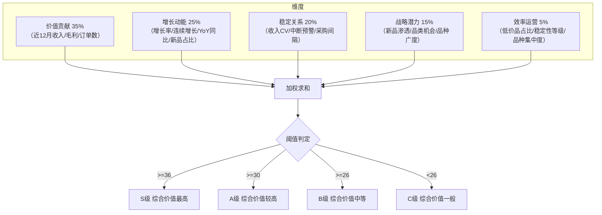
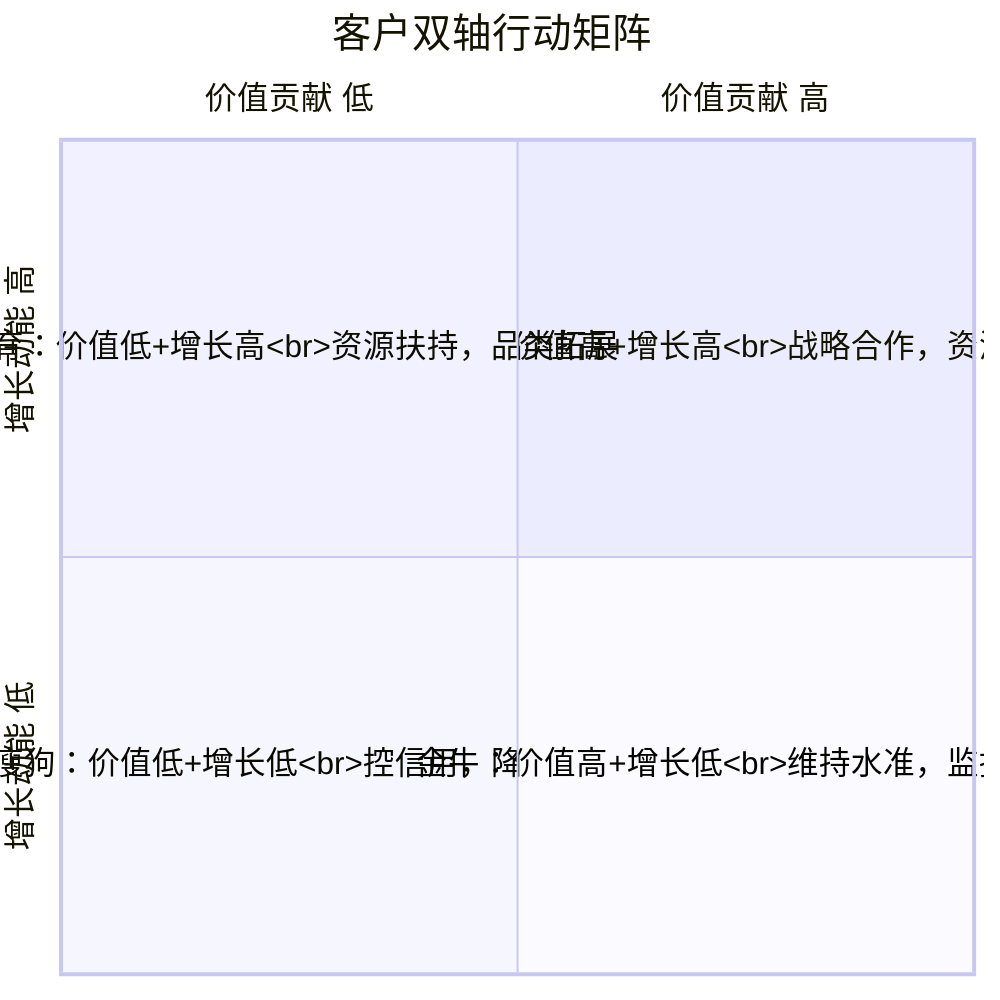
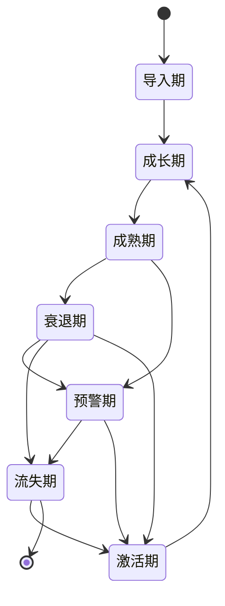
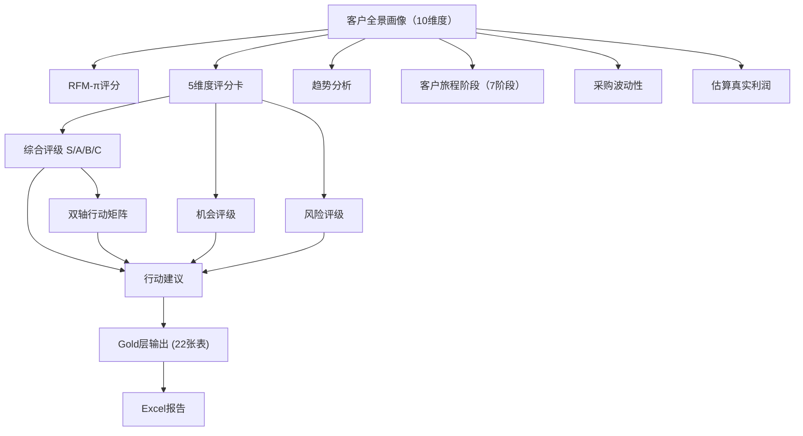

# 客户分析系统 — 功能文档

> 基于代码实际实现整理。本文档的目标是让非专业人士也能理解系统的整体架构、每项功能的作用，以及数据在整个系统中的流转过程。

---

## 1. 系统概述

客户分析系统从 ERP 导出的出货明细 Excel 读取数据，经过清洗、聚合、分析、评分等步骤，最终输出客户全景画像（60+指标/客户）、评分评级、定价建议、趋势分析等，形成 **20 张 Gold 表（CSV）** 和一份 **Excel 报告**。

### 数据管道

下面这张图展示了数据从原始 Excel 文件到最终报告的整体流转过程：



**简单来说**：原始数据（Excel）→ 清洗整理（Silver层）→ 分析和评分（客户分析+产品分析）→ 输出结果（Gold表+报告）。

### 评分金字塔体系

系统采用"五维度评分卡"作为核心评价体系，从 5 个角度给每个客户打分，最终形成综合评级和行动建议：


**通俗解释**：
- **基础指标层**：从数据中直接计算出来的原始数据（比如"过去一年买了多少钱"）
- **维度评分层**：将原始数据归类到 5 个维度，每个维度打出 0-100 分
- **综合评级层**：综合判断客户的整体价值、成长机会和风险水平
- **行动指引层**：根据评分结果，给出"该重点扶持"还是"该控制风险"等建议

### 运行流

下面展示系统从 Silver 层数据到最终 Gold 表的完整处理流程：

```
Silver层(3张聚合表)
  ↓ calc_customer_portrait()
客户全景(60+指标/每客户)
  ↓ score_rfm_pi()                 → RFM-π 五分位评分
  ↓ calc_composite_scores()        → 5维度评分卡（综合价值分 + 机会评级 + 风险评级）
  ↓ generate_action_suggestions()  → 行动建议（规则引擎）
  ↓ classify_customer_journey_stage() → 客户旅程阶段（7阶段）
  ↓ batch_calc_volatility()        → 采购波动性指标（CV/跌幅/等级）
  ↓ batch_estimate_true_profit()   → 估算真实利润（扣除服务成本）
  ↓ calc_monthly_revenue_trend()   → 月度营收趋势
  ↓ calc_category_migration()      → 品类迁移分析
  ↓ calc_customer_forecast()       → ETS客户预测（未来3月）
  ↓ price_deep_dive 4张表          → 价格深度分析
  ↓ generate_gold_tables()
22张Gold层CSV + Excel报告
```

### 入口

在命令行中执行以下命令即可运行：

```bash
python run_customer.py     # 单独运行客户分析
python run_all.py           # 全部运行（含产品生命周期）
```

---

## 2. 数据管道（Silver层构建）

### 2.1 数据清洗流程

原始 ERP 数据在进入分析之前，需要经过以下清洗步骤。这些步骤与产品生命周期系统共用同一套逻辑：

| 规则 | 位置 | 说明 |
|------|------|------|
| 负销量过滤 | `filter_negative_qty()` | 剔除数量 < 0 的记录（如退货单） |
| 毛利率Winsorization | `winsorize_margins()` | 将异常毛利率限制在 [-50%, 75%] 范围内 |
| ERP列名映射 | `rename_erp_columns()` | 按 `ERP_COL_MAP` 将原始列名重命名为标准名称 |

> 参数阈值在 `config/settings.py` 的 `CLEAN` 中配置。

### 2.2 分析窗口配置

Silver 层会过滤掉不必要的历史数据，聚焦于近期有效分析。窗口大小可在 `settings.py` 中调整：

| 参数 | 默认值 | 说明 |
|------|--------|------|
| `start_date` | 2024-01-01 | 分析起始日期（过滤此日期之前的数据） |
| `value_window_months` | 12 | 价值贡献分析的时间窗口长度（月） |
| `growth_window_months` | 12 | 增长对比的时间窗口长度（月） |
| `growth_window_short` | 6 | 短窗口（新客户数据不足时回退用） |
| `active_window_months` | 12 | 判定客户是否活跃的时间窗口 |

> 配置位置：`config/settings.py` → `CUSTOMER_ANALYSIS_WINDOW`

### 2.3 取数降级体系

系统遵循**三级取数策略**来保证每个指标都有值：优先使用最准确的数据源，如果没有则自动降级到次优方案，最后还有默认值兜底。



每个指标的取数路径：

| 指标 | Primary（最理想） | Fallback（降级方案） | Default（兜底） |
|------|---------|----------|---------|
| 客户层级 | CRM客户类别字段 | 无（已移除收入分箱回退） | "未分类" |
| 渠道类型 | CRM"代理商/直供"字段 | 交易数据规则推导（见下方） | "未知" |
| 产品线数 | 产品线列聚合 | 回退到产品系列列 | 0 |
| 订单数 | Silver层 order_count 聚合 | 交易数据去重计数 | 0 |

#### 渠道类型三级降级（重要）

渠道类型（代理/直供）的取数路径如下图所示：



**通俗解释**：系统会先看 CRM 里有没有记录这个客户是"代理"还是"直供"；如果没有，就看交易数据中这个客户出现在"代理商/直供名称"列（说明是代理）还是"实际终端客户"列（说明是直供）；如果两边都出现，就看哪边出现的次数更多。

> 配置位置：`config/settings.py` → `CHANNEL_DERIVE`

### 2.4 月度聚合

`monthly_aggregate_double_pass()` 一次调用输出 3 张 Silver 表：

| 表名 | 数据粒度 | 用途 |
|----|------|------|
| `customer_monthly` | 每客户 × 每月 | 客户全景计算、生命周期判断、采购健康分析 |
| `product_monthly` | 每产品 × 每月 | SKU生命周期、新品Cohort追踪 |
| `customer_x_product` | 每客户 × 每产品 × 每月 | 价格治理、集中度分析、产品线分布 |

**关于新品标记**：如果原始 Excel 中包含"是否新品"列，Silver 层的 `product_monthly` 表会自动携带该列信息。

---

## 3. 客户分析与评价体系

本章节是系统的核心，涵盖从客户基础信息采集到全方位评分的完整流程。

### 3.1 客户全景画像（10维度）

`calc_customer_portrait()` 遍历每个客户，从 10 个维度收集信息，形成完整的客户画像：

| 维度 | 核心指标 | 代码位置 |
|------|---------|---------|
| 基础信息 | 渠道类型、客户等级、所属区域、业务负责人 | `portrait.py:_dim_base_info()` |
| 经营势能 | 近12月收入/毛利/毛利率、前12月收入、增长率、订单数 | `portrait.py:_dim_momentum()` |
| 增长趋势 | 连续增长月数、连续下滑月数、YoY同比增速 | `portrait.py:_dim_momentum()` |
| 产品覆盖 | 在采品种总数、Top3品种集中度 | `portrait.py:_dim_product_coverage()` |
| 产品线分布 | 产品线数、主导产品线及占比、产品线HHI | `portrait.py:_dim_product_line_distribution()` |
| 采购健康 | 平均采购间隔、距上次采购天数、中断预警 | `dimensions.py` 包装自 `pricing.py` |
| 价格治理 | 加权ASP、ASP跌幅%、低价/中价/高价占比 | `dimensions.py` 包装自 `pricing.py` |
| 品类接受度 | 主导品类、品类机会标签 | `dimensions.py` 包装自 `pricing.py` |
| SKU生命周期 | 主要SKU阶段(客户高频阶段) | `dimensions.py` 包装自 `pricing.py` |
| 新品渗透 | 新品采购额/品种数/占比、是否采购新品 | `dimensions.py` 包装自 `pricing.py` |

#### 增长动能维度详解

增长动能维度包含以下核心指标：

**收入增长率**：比较"最近12个月"和"之前12个月"的平均月收入变化。如果数据不足12个月，自动回退到6个月短窗口计算。增长率 = (近期月均 - 前期月均) / 前期月均。

**连续增长/下滑月数**：按月比较，如果环比下降不超过5%，仍算作"增长"（放宽了严格递增的要求，使信号更灵敏）。这个指标反映了客户交易的稳定性趋势。

**YoY同比增速**（新增）：比较"最近12个月"和"再之前12个月"的平均月收入变化。需要至少24个月数据，能有效消除季节性波动的影响。增长率 = (近期月均 - 去年同期月均) / 去年同期月均。

#### 渠道类型推导

参见 §2.3 的渠道类型三级降级部分。渠道类型会影响后续的 RFM-π 评分（渠道隔离评分）和客户分层。

#### ASP_跌幅%截断

ASP_跌幅% = (客户ASP - 市场中位ASP) / 市场中位ASP × 100。为防止极端值干扰评分，截断至 -100%（即跌幅不超过 100%）。

> 配置位置：`config/settings.py` → `METRIC_CAPS.asp_decline_max_pct`

### 3.2 RFM-π评分（经典分析方法）

RFM-π 是一种经典的客户分析方法，从 4 个角度评估客户价值。与 5 维度评分卡不同，RFM-π 侧重客户的"近期表现"和"交易活跃度"。

#### 评分维度

| 维度 | 含义 | 数据列 | 方向 | 默认权重 |
|------|------|------|------|----------|
| R (Recency - 近度) | 距上次采购天数 | `距上次采购天数` | 越小越好（越近越好） | 30% |
| F (Frequency - 频次) | 常规平均采购间隔 | `常规平均采购间隔` | 越小越好（越频繁越好） | 20% |
| M (Monetary - 金额) | 近12月毛利 | `近12月毛利` | 越大越好 | 30% |
| π (Profit - 新品) | 新品采购占比 | `新品采购占比` | 越大越好 | 20% |

#### 评分方法

每个维度使用五分位法（`pd.qcut`）打分 1-5 分：

| 方向 | 5分（最好） | 4分 | 3分 | 2分 | 1分（最差） |
|------|-----|-----|-----|-----|-----|
| 反向(R/F) | 最短20% | 次短20% | 中间20% | 次长20% | 最长20% |
| 正向(M/π) | 最高20% | 次高20% | 中间20% | 次低20% | 最低20% |

**综合得分** = R_得分×0.30 + F_得分×0.20 + M_得分×0.30 + P_得分×0.20

#### 综合分层

| RFMπ综合分 | 层级 |
|--------|------|
| ≥ 4.0 | S级 |
| 3.5 ~ 4.0 | A级 |
| 2.5 ~ 3.5 | B级 |
| < 2.5 | C级 |

#### 渠道隔离评分

为什么要做渠道隔离？直销客户（终端厂商）和代理客户（渠道分销商）的采购行为本质不同。放在一起评分时，代理客户的 R/F/M 维度指标会全面偏低，分层失去意义。

**渠道隔离评分** = 按 `渠道类型`（直销/代理）分组后，分别做五分位排名 + 使用渠道特定权重：

| 渠道 | R权重 | F权重 | M权重 | P权重 |
|------|-------|-------|-------|-------|
| 直销(direct) | 30% | 20% | 30% | 20% |
| 代理(agent) | 25% | 25% | 25% | 25% |

> 当某渠道客户数 < 5 时，数据量不足无统计意义，自动回落为统一评分（默认权重）。
> 配置位置：`config/settings.py` → `RFM_PI_WEIGHTS`

### 3.3 5维度评分卡（核心评价体系）

5维度评分卡是系统的**核心评价体系**，从 5 个角度给每个客户综合评分。每个维度 0-100 分，加权后得到综合价值分，再判定评级。

#### 评分方法



**通俗解释**：
- **价值贡献（权重35%）**：衡量客户给公司带来了多少生意，包括收入、毛利、订单数
- **增长动能（权重25%）**：衡量客户未来还有多少增长潜力，包括增长率、连续增长、新品接受度
- **稳定关系（权重20%）**：衡量客户关系是否稳固，包括采购波动性、中断风险
- **战略潜力（权重15%）**：衡量客户在品类拓展和新品接受方面的潜力
- **效率运营（权重5%）**：衡量服务该客户的成本效率

**评分过程**：
1. 每个维度下有若干子指标
2. 对每个子指标做 Min-Max 归一化（注意：仅对**活跃客户**做归一化，非活跃客户直接给 25 分默认值）
3. 加权求和得到维度分（0-100）
4. 5 个维度加权求和得到综合价值分
5. 按阈值判定 S/A/B/C 等级

#### 综合评级

| 综合价值分 | 评级 | 含义 | 当前分布 |
|-----------|------|------|---------|
| ≥ 36 | S级 | 综合价值最高，优质客户 | ~8% |
| ≥ 30 | A级 | 综合价值较高 | ~20% |
| ≥ 26 | B级 | 综合价值中等 | ~24% |
| < 26 | C级 | 综合价值一般 | ~48% |

#### 机会评级

机会评级回答"这个客户还有多少增长空间？"

**公式**：机会评级分 = 增长动能分 × 0.60 + 战略潜力分 × 0.40

| 机会评级分 | 等级 | 当前分布 |
|-----------|------|---------|
| ≥ 27 | 极高 | ~10% |
| ≥ 20 | 高 | ~25% |
| ≥ 13 | 中 | ~30% |
| < 13 | 低 | ~35% |

#### 风险评级

风险评级回答"这个客户流失或恶化的可能性有多大？"

**公式**：风险评级分 = (100 - 稳定关系分) × 0.70 + (100 - 效率运营分) × 0.30

注意：稳定关系分越高（越稳定），风险评级越低；效率运营分越高（越高效），风险评级越低。

| 风险评级分 | 等级 | 当前分布 |
|-----------|------|---------|
| ≥ 70 | 极高 | <1% |
| ≥ 50 | 高 | ~3% |
| ≥ 20 | 中 | ~15% |
| < 20 | 低 | ~82% |

### 3.4 客户层级（独立分类）

客户层级反映客户**自身的营收规模**（即客户公司一年的总收入），不是在我方的采购量。这个信息主要来自 CRM 系统。

| 层级 | 定义（客户自身年营收） | 来源 | 策略含义 |
|------|------------------|------|---------|
| KA | 年营收 > 1亿元 | CRM客户类别字段 | 大企业，战略级客户 |
| AA | 年营收 > 5000万元 | CRM客户类别字段 | 中大型企业 |
| KM | 年营收 > 1000万元 | CRM客户类别字段 | 中型企业 |
| MM | 年营收 < 1000万元 | CRM客户类别字段 | 小微企业 |

**取数规则**：仅从 CRM 获取（客户类别字段），不再用我方采购额反推。如果 CRM 未匹配到，则标为"未分类"。

> 配置位置：`config/settings.py` → `CUSTOMER_TIER_MAP`

### 3.5 双轴行动矩阵

双轴矩阵以**价值贡献分**为横轴、**增长动能分**为纵轴，用活跃客户的中位数作为分界线，将客户分为 4 个象限，每个象限对应不同的策略：



| 分类 | 策略 | 典型销售动作 |
|------|------|-------------|
| **明星** | 战略合作、资源倾斜 | FAE深度支持、全产品线导入、优先供货 |
| **金牛** | 维持水准、监控竞争 | 定期回访、关注竞品动态、维持服务水平 |
| **培育** | 资源扶持、品类拓展 | 新品推荐、技术交流、培育增量 |
| **瘦狗** | 控信用、降成本 | 线上服务为主、减少上门、优化服务成本 |

**关于阈值设定**：矩阵的分界线使用活跃客户（近12月有交易的客户）的价值分和增长分的**中位数**。这意味着矩阵的 4 个象限各有约 25% 的活跃客户，保证了区分度。

---

## 4. 价格分析体系

价格分析体系从多个角度分析价格合理性，帮助发现定价问题和提价/降价机会。

### 4.1 价格偏离度 [已合并到客户全景画像]

> **注意**: 原先独立的 `calc_price_deviation()` 函数已合并到 `portrait.py:_dim_asp_comparison()` 中，在客户全景画像生成时同步计算 ASP 偏离度，不再作为独立 Gold 表输出。偏离度 = (客户平均价 - 全市场中位价) / 全市场中位价。

> 最低月数要求：`CUSTOMER_THRESHOLDS.price_deviation_min_months`（默认3个月）

### 4.2 价格带分布

`calc_price_band_distribution()` — 按 P25/P75 分界，将价格分为低价/中价/高价三档，分析每个客户在各价格带的采购占比。

### 4.3 跨客户价格差异

`calc_cross_customer_price_dispersion()` — 用变异系数(CV)衡量同一产品在不同客户之间的价格离散程度。

| CV值 | 结论 |
|------|------|
| CV > 0.30 | 价格差异大，标记"价格混乱"，需关注 |
| CV 0.15~0.30 | 价格有一定差异，合理范围内 |
| CV < 0.15 | 价格一致性高 |

> 对应 Gold 表：`价格离散度.csv`

### 4.4 跨客户价格差异分析（深度）

`calc_cross_customer_price_variation()` — 分析每个产品在不同客户之间的价格差异，找出最低价/最高价客户：

| 输出字段 | 含义 |
|---------|------|
| 产品品种/分类 | 分析的产品 |
| 平均价格/中位数/P25/P75 | 价格分布统计 |
| 价格CV | 离散程度 |
| 最低价/最高价客户 | 价格极值对应的客户 |
| 客户数 | 该产品的购买客户数量 |
| 价格差异等级 | CV>0.3=高，CV>0.15=中，<0.15=低 |

### 4.5 渠道价格对比

比较同一产品在**代理渠道**和**直销渠道**之间的价格差异：

| 输出字段 | 含义 |
|---------|------|
| 产品品种 | 分析的产品 |
| 代理均价 / 直供均价 | 两个渠道的平均价格 |
| 价差% | (代理-直供)/直供 × 100 |
| 代理/直供客户数 | 各渠道的客户数量 |

> 对应 Gold 表：`渠道价格对比.csv`

### 4.6 业务员定价偏离分析

分析每个业务员的定价偏离市场平均水平的情况：

| 输出字段 | 含义 |
|---------|------|
| 业务负责人/所属区域 | 业务员信息 |
| 平均定价偏离% | 该业务员客户的价格 vs 市场中位 |
| 高价占比 | 高于 P75 的价格占比 |
| 低价占比 | 低于 P25 的价格占比 |
| 客户数 / 总营收 | 业务规模 |

> 对应 Gold 表：`业务员定价偏离.csv`

### 4.7 市场细分价格

按客户层级、所属区域、产品线等维度聚合，对比不同细分市场的价格水平：

| 输出字段 | 含义 |
|---------|------|
| 细分维度 | 客户层级 / 所属区域 / 产品线 |
| 细分值 | 如 KA / 华南 / MOS管 |
| 均价 / 中位数 | 该细分市场的价格水平 |
| 价格指数 | 该细分市场均价 / 整体均价 × 100 |
| 客户数 | 该细分市场的客户数量 |

> 对应 Gold 表：`市场细分价格.csv`

### 4.8 定价建议

基于价格分析结果，给出提价和降价的具体建议。

#### 提价空间

`calc_markup_opportunity()` — 同时满足以下 3 个条件时，认为存在提价空间：

1. 客户实际价 ≤ 产品中位价 × 0.90（客户买得比市场价低至少 10%）
2. 客户连续采购 ≥ 6 个月（关系稳定）
3. 客户采购量 ≤ 总销量 × 30%（不依赖单一客户）

> 对应 Gold 表：`提价机会.csv`

#### 降价策略

`calc_markdown_recommendation()` — 基于固定弹性系数(-1.0)试算 4 档降价幅度对销量的影响：

| 降价幅度 | 3% | 5% | 8% | 10% |
|---------|----|----|----|-----|

> 对应 Gold 表：`降价策略试算.csv`

---

## 5. 客户生命周期与 B2B v2

### 5.1 客户生命周期（6阶段）

`calc_customer_lifecycle_stage()` 根据交易数据判定客户所处的生命周期阶段：

| 阶段 | 判定条件 | 通俗解释 |
|------|---------|---------|
| 导入期 | 首次采购距今 ≤ 12月 | 刚开始合作的客户 |
| 爬坡期 | 近N月环比增长 ≥ 阈值（默认5%/3月） | 交易量在增长 |
| 成熟期 | 月收入在均线附近稳定波动 | 交易稳定的老客户 |
| 衰退期 | 连续3月低于均线15% | 交易量在萎缩 |
| 休眠期 | 180~360天无采购 | 很久没交易了 |
| 流失期 | ≥ 360天无采购 | 基本确定流失 |

> 爬坡期参数由 `CUSTOMER_THRESHOLDS` 配置。

### 5.2 SKU生命周期（5阶段）

`calc_sku_lifecycle_stage()` — 5阶段状态机，判断每个产品所处的生命周期阶段：

| 阶段 | 条件 | 通俗解释 |
|------|------|---------|
| 导入试销 | 在售<3月+低量 | 刚推出市场 |
| 成长爬坡 | 近3月环比>增速阈值 | 销量在增长 |
| 平稳成熟 | 持续>6月 | 稳定的成熟产品 |
| 隐性衰退 | 连续下滑但总量可观 | 表面还行但已在下滑 |
| 衰退出清 | 连续下滑+低于峰值30% | 即将退出市场 |

### 5.3 客户旅程阶段（7阶段分类器）

`src/journey/stage_classifier.py` — 这是一个更精细的客户状态分类器，将客户分为 7 个阶段（按优先级从高到低）：



| 优先级 | 阶段 | 判定条件 | 通俗解释 |
|--------|------|---------|---------|
| 1 | **激活期** | 历史有 >180天间断后重新交易 | 老客户回头 |
| 2 | **导入期** | 首次交易 ≤6月 且 总订单 ≤3 | 刚合作的客户 |
| 3 | **流失期** | 距上次 >90天 且 近6月无交易 | 基本流失 |
| 4 | **衰退期** | 近6月环比跌幅 ≥20% 且 连续下滑 ≥2月 | 快速下滑 |
| 5 | **成长期** | 近6月环比增长 ≥30% 或 频次激增 ≥2倍 | 快速增长 |
| 6 | **成熟期** | 近12月CV <0.3 且 金额排名前30% | 稳定优质客户 |
| 7 | **稳定期** | 默认兜底，不符合以上任何条件 | 普通稳定 |

> 配置位置：`config/settings.py` → `CUSTOMER_JOURNEY_THRESHOLDS`

### 5.4 采购波动性指标

`src/behavior/volatility.py` — 衡量客户采购行为的稳定程度：

| 指标 | 计算方式 | 含义 |
|------|---------|------|
| 收入CV | 月度金额标准差 / 均值 | 波动越大，CV越高 |
| 最大单月跌幅 | max(月环比下跌比例) | 历史上跌得最惨的一个月 |
| 零采购月占比 | 零金额月数 / 总月数 | 多少个月份完全没采购 |
| 趋势R² | 线性回归拟合优度 | 趋势是否明显 |

**稳定性等级**（基于以上指标综合判断）：

| 等级 | 条件 | 含义 |
|------|------|------|
| 高稳定 | CV <0.3 且 零月占比 <10% | 采购规律可预测 |
| 中等稳定 | CV <0.6 且 零月占比 <20% | 偶尔波动但不严重 |
| 高波动 | 其他（含数据不足） | 采购很不规律 |

> 配置位置：`config/settings.py` → `VOLATILITY_METRICS`

### 5.5 新品Cohort追踪

`calc_new_product_cohort()` — 追踪新品上市后客户的采购情况。

#### 新品判定（双轨制）

系统按以下优先级判断某产品是否为"新品"：

```python
# 优先级1：ERP标记 — 如果Excel中有"新品标记"列
if "新品标记" in prod_monthly.columns:
    new = prod_monthly.groupby(prod_col)["新品标记"].apply(
        lambda s: (s == "是").any()
    )
    new_products = new[new].index.tolist()
# 优先级2：自动计算（如果Excel中没有标记列）
else:
    new = 首次销售月距今 ≤ max_months  # 默认12个月内的算新品
```

#### 输出指标

| 指标 | 说明 |
|------|------|
| 新品采购额 | 客户对新品的总采购金额 |
| 新品品种数 | 客户采购了多少个新品 |
| 新品采购占比 | 新品采购额 / 总采购额 |
| 是否采购新品 | 只要有新品采购即标记为"是" |
| 新品渗透率 | 采购新品的客户数 / 总客户数（全市场看） |

### 5.6 估算真实利润

`src/profitability/true_profit_estimator.py` — 在毛利率基础上扣除各项服务成本，得到更真实的利润：

**真实利润 = 近12月毛利 - 订单处理成本 - 物流成本 - 售后成本 - 资金占用成本**

| 成本项 | 默认参数 | 计算方式 | 通俗解释 |
|--------|---------|---------|---------|
| 订单处理成本 | 50元/单 | 订单数 × 单价 | 每张订单的操作成本 |
| 物流成本 | 营收×2% | 营收 × logistics_cost_rate | 发货运输成本 |
| 售后成本 | 退货金额×30% | 无退货数据时按营收×2%×30%估算 | 售后服务的费用 |
| 资金占用成本 | 年利率6% | 应收账款 × 利率 × DSO/365 | 给客户垫资的资金成本 |

> 配置位置：`config/settings.py` → `ESTIMATED_COST`

**利润等级**：
- 真实利润率 > 15% → 高利润
- 真实利润率 > 0% → 微利
- 真实利润率 ≤ 0% → 亏损

### 5.7 采购健康度

#### 常规平均采购间隔

`calc_purchase_interval()` — 计算客户平均每隔多少个月采购一次（剔除前 6 个月的数据，避免刚合作时的异常值）。

#### 采购中断预警

`calc_churn_warning()` — 判断客户是否有流失风险：

```
预警条件：距上次采购天数 > 常规间隔 × 1.5（系数可配置）
```

通俗解释：如果客户已经有很长时间没下单了，远超他平时的采购间隔，系统就会发出预警。

#### 产品集中度

`calc_product_concentration()` — 分析客户的采购是否过度依赖少数产品：

```
Top5集中度 = Top5品种采购额 / 总采购额
强依赖标记条件：Top5集中度 ≥ 0.70
```

通俗解释：如果客户 70% 以上的采购集中在 5 个产品上，说明他对这些产品的依赖度很高，一旦出问题影响很大。

---

## 6. 趋势分析

趋势分析模块从时间维度观察客户行为的变化。

### 6.1 月度营收趋势

`calc_monthly_revenue_trend()` — 每个客户每月一行，包含以下字段：

| 字段 | 计算方式 | 通俗解释 |
|---------|---------|---------|
| 月收入 / 毛利 | 当月数据汇总 | 每月赚了多少钱 |
| 月收入MA3/MA6 | 近3月/6月移动平均 | 平滑后的收入趋势 |
| 月环比增速 | (本月-上月)/上月 | 跟上个月比涨了多少 |
| YoY同比增速 | (本月-去年同月)/去年同月 | 跟去年同月比涨了多少 |
| 收入斜率_6月 | 6月线性回归斜率 | 最近半年的整体趋势线 |
| 趋势方向 | 上升/平稳/下降 | 综合判断是涨了还是跌了 |

> 对应 Gold 表：`客户月度趋势.csv`

### 6.2 品类迁移分析

`calc_category_migration()` — 观察客户采购品类结构的变化。比如客户从"低端品类"转向"高端品类"，或者从"核心品类"转向"边缘品类"。

| 字段 | 含义 |
|---------|------|
| 客户编号 / 期间 | 每客户每半年分析一次 |
| 产品线 / 产品线收入占比 | 当期各品类占比 |
| 品类占比变化% | 相比上期的变化 |
| 品类排名 / 排名变化 | 品类热度变化 |

**业务价值**：
- 客户从低端品类转向高端品类 → 价值提升信号
- 客户从核心品类转向边缘品类 → 竞争替代风险
- 为"品类的机会标签"提供历史数据支持

> 对应 Gold 表：`品类迁移.csv`

### 6.3 ETS客户预测

`calc_customer_forecast()` — 使用 ETS 统计模型，预测客户未来 3 个月的营收。

| 字段 | 含义 |
|---------|------|
| 预测月份 | 最近月份 +1~+3 月 |
| 预测收入 / 置信区间 | ETS模型输出的预测值和可能的波动范围 |
| 模型类型 | ETS(A,N,N) / ETS(A,A,N) 等 |
| MAPE(训练集) | 模型在历史数据上的平均预测误差（<30% 为可信） |

**限制**：仅对历史数据 ≥ 12 个月的客户进行预测。数据不足的客户不输出预测结果。

> 对应 Gold 表：`客户预测.csv`

---

## 7. 终端客户主数据整合

`customer_master.py:load_customer_master()` + `enrich_customer_portrait()`

系统将 ERP 交易数据中的客户编号与 CRM 中的终端客户信息进行匹配，从而丰富客户的属性信息。

### 7.1 三阶匹配策略

匹配过程按优先级进行，前面的匹配不上才尝试后面的：

1. **全称精确匹配**：公司工商全称完全匹配
2. **简称精确匹配**：公司简称完全匹配  
3. **模糊匹配**：使用 rapidfuzz 库，相似度 > 85 即认为匹配

### 7.2 整合字段

匹配成功后，以下 CRM 字段会补充到客户画像中：

| 字段 | 默认值 | 来源 | 用途 |
|------|--------|------|---------|
| 客户类别 | 未分类 | CRM | 判断客户层级（KA/AA/KM/MM） |
| 细分市场 | 未知 | CRM | 了解客户所在行业 |
| 应用场景 | 未分类 | CRM | 了解产品用途 |
| 销售部门 | 未知 | CRM | 了解客户归哪个销售团队负责 |
| 业务负责人（拓尔销售） | 未知 | CRM | 了解谁在负责这个客户 |
| 工商注册地址 | 未知 | CRM | 区域分析 |
| 代理商账号 | 未知 | CRM | 终端客户对应的代理商 |

### 7.3 客户层级映射

CRM"客户类别"字段 → 标准层级的映射规则：

| CRM值 | 映射层级 | 含义 |
|-------|---------|------|
| KA>1亿 | KA | 年营收超1亿的大客户 |
| AA>5000万 | AA | 年营收超5000万的客户 |
| KM>1000万 | KM | 年营收超1000万的客户 |
| MM<1000万 | MM | 年营收不足1000万的小客户 |
| KMM2 | KM | 另一种中型客户分类 |
| X | 未分类 | 无法判断层级 |

---

## 8. 集团聚合

集团聚合模块识别哪些客户属于同一个集团（如"比亚迪"旗下的多家子公司），然后从集团层面汇总分析。

### 8.1 手工映射

系统预先配置了已知的集团-子公司关系：

| 集团 | 包含关键词 | 说明 |
|------|-----------|------|
| 比亚迪集团 | 比亚迪 | 含所有名称含"比亚迪"的客户 |
| 视源集团 | 视源、视琨、视骁、视乾 | 视源股份及其子公司 |
| 欧菲光集团 | 欧菲 | 欧菲光及其子公司 |
| 拓尔微电子 | 拓尔微 | 拓尔微电子 |
| 新晔电子 | 新晔 | 新晔电子 |

### 8.2 自动前缀检测

对于未被手工映射覆盖的客户，系统会自动检测名称中包含相同前缀（≥3个中文字符且至少有3个客户共享此前缀）的客户，将其归为一个潜在的集团。

**为何要排除城市名**：深圳、北京等城市名虽然出现频率高，但不是集团标志。

### 8.3 集团评分与风险聚合

将集团内各个客户的数据汇总，得到集团级别的指标：

| 聚合指标 | 计算方式 |
|---------|---------|
| 集团总收入/总毛利 | 各成员求和 |
| 集团加权毛利率 | 总毛利/总收入 |
| 集团产品线覆盖 | 各成员产品线的并集（不重复计数） |
| 集团衰退风险占比 | 衰退期产品金额 / 总收入 |
| 集团活跃/休眠成员 | 各成员的客户生命周期阶段判断 |

> 对应 Gold 表：`集团聚合.csv`

---

## 9. Gold层输出与报告

系统最终输出 20 张 Gold 表（CSV格式，可直接用 BI 工具打开）和 1 份 Excel 报告。

### 9.1 核心画像表

| 文件名 | 粒度 | 内容 | 行数 |
|--------|------|------|------|
| `客户全景.csv` | 每客户一行 | 60+列：基础信息+全景画像+RFM-π评分+5维度评分卡+旅程阶段+波动性+真实利润 | 310 |
| `客户产品桥接.csv` | 客户×产品×月 | 客户采购明细 + 产品画像引用 | 94,609 |
| `客户组合健康度.csv` | 每客户一行 | 各画像产品金额占比 + 衰退品占比 | 310 |
| `SKU生命周期.csv` | 每SKU一行 | 生命周期阶段判定 | 794 |
| `品类接受度.csv` | 客户×品类 | 品类覆盖情况（仅数据含品类列时生成） | 条件生成 |

### 9.2 趋势分析表

| 文件名 | 粒度 | 内容 |
|--------|------|------|
| `客户月度趋势.csv` | 客户×月份 | 月收入/毛利/MA3/MA6/环比/同比/趋势方向 |
| `品类迁移.csv` | 客户×半年度 | 品类结构变化 |
| `客户预测.csv` | 客户×未来3月 | ETS预测收入 + 置信区间 |

### 9.3 价格分析表

| 文件名 | 粒度 | 内容 |
|--------|------|------|
| `价格离散度.csv` | 每产品一行 | 跨客户价格CV分析 |
| `跨客户价格差异.csv` | 产品×客户 | 每个产品在不同客户间的价格对比 |
| `渠道价格对比.csv` | 产品×渠道 | 代理vs直供价格差异 |
| `业务员定价偏离.csv` | 业务员 | 各业务员定价偏离市场情况 |
| `市场细分价格.csv` | 细分维度 | 按层级/区域/产品线聚合价格 |
| `提价机会.csv` | 客户×产品 | 存在提价空间的组合 |
| `降价策略试算.csv` | 客户×产品 | 4档降价弹性试算 |

### 9.4 产品分析表

| 文件名 | 粒度 | 内容 |
|--------|------|------|
| `gold_product_portrait.csv` | 每产品一行 | 产品画像（40+指标） |
| `cross_customer_portfolio_health.csv` | 客户×画像 | 客户组合健康度 |
| `cross_product_customer_health.csv` | 产品×风险 | 产品客户群健康度 |

### 9.5 KPI通道

| 文件名 | 粒度 | 内容 |
|--------|------|------|
| `gold_kpi_daily.csv` | 每日一行 | 汇总销售额/数量/订单数/客户数/品种数 + Top5客户/产品 + 本月累计 |

### 9.6 集团聚合

| 文件名 | 粒度 | 内容 |
|--------|------|------|
| `集团聚合.csv` | 每集团一行 | 总收入/毛利/产品线覆盖/衰退风险/活跃成员 |

### 9.7 Excel报告

`客户分析报告_v1.1_*.xlsx` 包含上述所有表 + 预警清单（红色表头标出异常客户），方便业务人员直接查看。

### 决策流程汇总

下面的流程图展示了从客户画像到行动建议的完整决策过程：



---

## 10. 注意事项与改进方向

### 10.1 数据质量说明

**CRM覆盖率有限**：当前 310 个客户中，约 190 个（60%）能匹配到 CRM 数据，仍有约 120 个客户缺少终端主数据。这意味着这些客户的层级、区域、负责人等信息不完整。

| 项目 | 当前状态 | 建议 |
|------|---------|------|
| CRM匹配率 | ~60%（含模糊匹配85%阈值） | 补充终端客户主数据 |
| 集团覆盖率 | 27/310（8.7%，6个集团） | 需业务提供更完整的集团-子公司关系表 |
| 渠道类型覆盖率 | 310/310（100%） | ✅ 已通过三级降级完全覆盖 |
| 客户层级完整度 | 依赖CRM匹配 | CRM未匹配标"未分类" |

**成本估算可靠性说明**：
- 当前成本参数（`ESTIMATED_COST`）为固定估算值，未接入真实物流、仓储、售后成本数据
- `订单处理成本率`、`物流成本率` 等指标因缺乏真实数据，已在效率运营维度中移除

### 10.2 Fallback机制汇总

系统总共有 19 项降级回退方案，确保在数据不完整的情况下仍能输出结果。以下是高优先级的几项：

| 优先级 | 回退项 | 触发条件 | 当前状态 |
|--------|--------|---------|---------|
| 🔴 高 | CRM匹配 | CRM无数据 | 通过模糊匹配（85%阈值）部分补偿 |
| 🔴 高 | 集团识别 | 未手工映射 | 手工+自动前缀检测 |
| 🟡 中 | 客户层级 | CRM匹配失败 | → "未分类"（已移除收入分箱回退） |
| 🟢 低 | 渠道类型 | CRM无值 | 三级降级：CRM→交易推导→默认，**100%覆盖** |

> 完整 19 项回退方案参见 [docs/fallback_logic.md](docs/fallback_logic.md)

### 10.3 当前项目不足

| 不足 | 影响 | 计划 |
|------|------|------|
| 价格弹性固定为 -1.0 | 降价策略试算不够准确 | 后续用 OLS 做实证弹性估计 |
| 季节性分解未实现 | 无法区分季节性波动和异常下滑 | 计划用 statsmodels 的季节性分解 |
| 评分权重缺乏敏感性验证 | 不确定权重配比是否最优 | 计划做权重敏感性模拟测试 |
| 集团覆盖率仅 8.7% | 集团级分析代表性不足 | 需业务补充集团映射表 |
| 增长动能维度缺少趋势指标纳入 | 趋势信号未进入评分 | 计划将 YoY/斜率等纳入评分 |

### 10.4 拓展建议

以下功能有价值但需要更多数据或资源支持，后续逐步实施：

**短期可做**（已有代码或数据）：
1. **产品关联分析**（`shared/customer_analysis.py` 已有代码）— 挖掘客户同时采购的产品组合，用于交叉销售推荐
2. **RFM传统分群**（`shared/customer_analysis.py` 已有代码）— 与 RFM-π 评分对比验证

**中期规划**（需补充数据）：
3. **实证价格弹性** — 用历史数据 OLS 回归估计实际弹性，替代固定值 -1.0
4. **数据质量看板** — 自动生成数据质量报告，标记缺失/异常数据
5. **季节性分解** — 识别客户季节性采购模式，区分季节性波动和趋势变化

**长期规划**（需业务协作）：
6. **经销商覆盖终端客户质量** — 评估经销商覆盖的终端客户数量、行业分布、TAM规模
7. **集团采购集中度** — 集团级采购金额、集中度、子公司间替代风险
8. **流失预测模型** — 基于历史交易模式预测客户流失概率
9. **多列联合CRM匹配** — 名称+区域联合匹配，提高准确率
