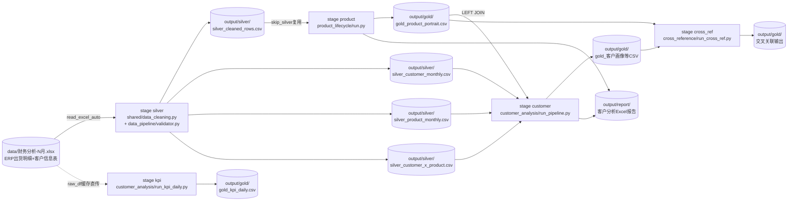
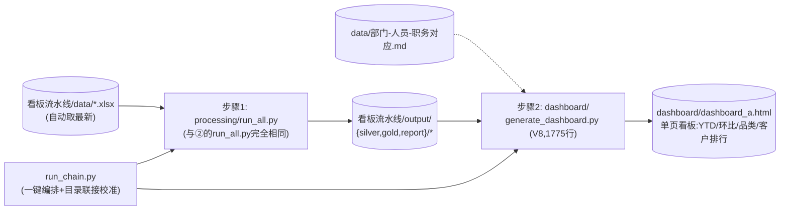
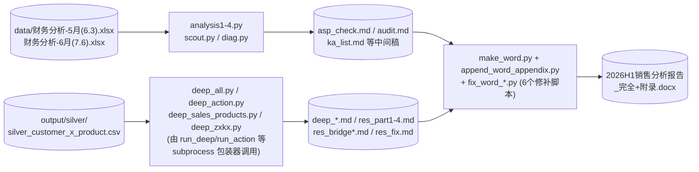
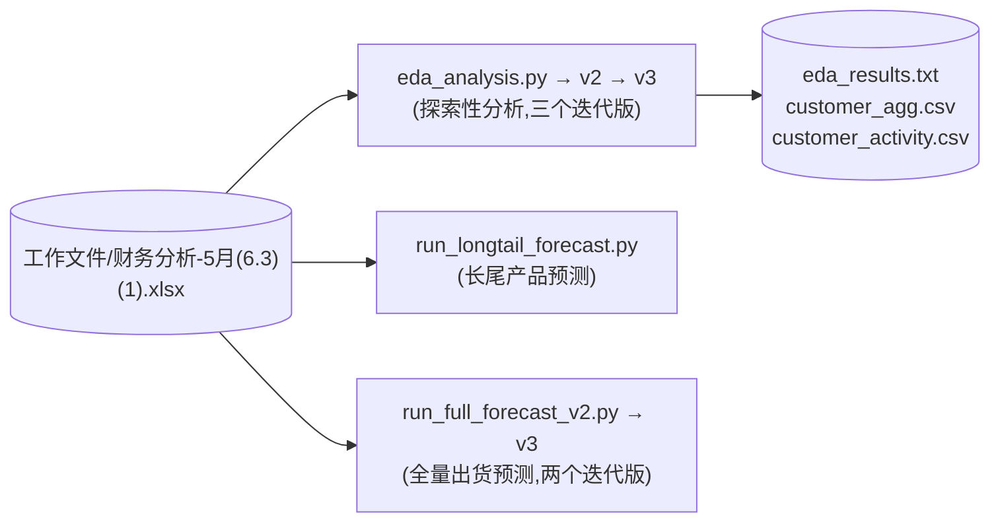
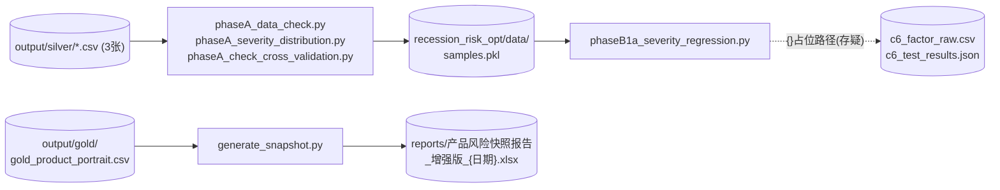

# 03 端到端数据流拓扑

> 方法说明:本报告结合两种证据构建依赖图——
> 1. **源码核实**(✅):对主干入口 `run_all.py`、`run_chain.py` 及其调用的模块做了逐行确认;
> 2. **字面边自动提取**(🔍):从 562 个脚本的 AST 中提取 read_csv/read_excel/to_csv 等字面路径,
>    对推荐版本集合做连通分量分析(完整数据见 `03_data_flow_auto.json`)。
> 标注「存疑」的边为推断,未经运行验证。

## 总览

全部数据处理活动围绕一个中心枢纽:**`output/silver/`(4 张月度聚合 CSV)→ `output/gold/`(分析结果 CSV)**。
主管道产出 silver/gold,多个卫星消费方(看板、衰退风险、预测、审计脚本)从枢纽取数。

```
原始Excel(财务分析-N月.xlsx, ~200MB/月)
        │
        ▼
  [silver 阶段]  ──► output/silver/*.csv (4张) ──┬─► [product] ──► gold_product_portrait.csv
                                                 ├─► [customer] ──► gold_客户*.csv 等
                                                 ├─► [kpi]      ──► gold_kpi_daily.csv
                                                 └─► [cross_ref]──► 交叉关联输出
                                                                 │
        ┌────────────────────────────────────────────────────────┤
        ▼                        ▼                               ▼
  generate_dashboard.py    recession_risk_opt/              各类 audit/check
  ──► dashboard_a.html     ──► 风险快照报告xlsx              临时脚本(仅读)
```

---

## 链路 L1:主流水线(半导体销售分析)✅ 源码核实

**入口**: `工作文件/semiconductor_analysis/run_all.py`(另有 ①③④ 三个年代副本,见 02_clusters.md)
**阶段顺序**(由 `RUN_STAGES` 配置,默认 `silver,product,customer,kpi,cross_ref`):



**关键事实**:
- silver 有缓存机制:`SKIP_SILVER_IF_EXISTS` + 配置校验和(`.silver_checksum`),配置变更自动失效;
- product 阶段读 `silver_cleaned_rows.csv`(避免重读 200MB Excel,代码注释称省 198s);
- customer 阶段读 silver 三张聚合表 + LEFT JOIN `gold_product_portrait.csv`(B2B v2 模块在此并入);
- kpi 阶段可直接吃内存中的 raw_df(同进程缓存),也可独立运行读源 Excel;
- `--force-silver` 会**删除** output/silver/ 下全部文件(冒烟测试勿用)。

---

## 链路 L2:看板流水线(便携包,已自带编排器)✅ 源码核实

**位置**: `看板流水线/` —— 这是②项目「数据处理+HTML看板」的**已打包便携版**,自带 README/requirements/编排器。



**关键事实**:
- `run_chain.py` 用 `mklink /J` 把 `processing/output` 联接到包根 `output/`,解决前段输出路径不统一问题;
- `--skip-processing` 可只重生成看板(快路径);
- 整个文件夹设计为可整体拷贝移动("便携包")——**它本身就是一个合格的分支**,阶段五原样提取。

---

## 链路 L3:深度分析报告群(ad-hoc 分析,39 脚本组件)🔍 自动发现

**位置**: `工作文件/semiconductor_analysis/` 根目录的 analysis1-4 / deep_* / bridge* / res_* 系列



**关键事实**:
- 这是一次性「2026H1 销售分析报告」生产链:先探索(scout/diag)→ 四维深挖(deep_*)→ 片段稿(res_*)→ Word 拼装与修补;
- **全部硬编码 `C:/Users/45091/Desktop/...` 路径** —— 证明②这批文件整体来自另一台电脑的桌面;
- run_*.py(6个)只是 subprocess 包装器,把 stdout/stderr 尾部写入 *_err.txt;
- fix_word_* 系列(6个)是对同一 docx 的反复修补,属同一功能的不同尝试,建议只保留 make_word.py + append_word_appendix.py,其余归档(存疑:需人工确认最终版)。

---

## 链路 L4:EDA 与出货预测实验(6 脚本组件)🔍 自动发现

**位置**: `工作文件/` 根目录(不在嵌套项目内)



**建议**:v3 为最终迭代,保留 v3 + run_longtail_forecast.py;v1/v2 归档。

---

## 链路 L5:衰退风险优化(recession_risk_opt,消费 silver/gold)🔍 自动发现

**位置**: `semiconductor_analysis/recession_risk_opt/`(②中同名目录为推荐版的有:phaseA 系列)



**存疑**: `{}/c6_factor_raw.csv`、`{}/prospective_labels.csv` 为 f-string 模板路径,静态分析无法解析实际目录;`models/best_config.json` 引用但未在磁盘找到(可能未生成或已删除)。

---

## 链路 L6/G:其余小型组件🔍

| 组件 | 脚本 | 数据关系 | 判断 |
|---|---|---|---|
| 统一预测系统 | `unified_forecast_system.py` + backup_v1/v2/v3 + `unified_forecast_v3.py`(①根目录) | 读 `quarterly_forecast_package/output/.../预测方案总行版.csv` | 同一系统的 5 个年代版本,**保留 unified_forecast_v3.py 待人工确认**,其余归档 |
| scripts/ 预测 | `scripts/chart_data.py` + `scripts/final_forecast.py`(①) | 读 `output/silver/silver_cleaned_rows.csv` | 主流水线 silver 的下游消费者 |
| quarterly_forecast_package | ①②均有此目录 | 产出 `预测方案总行版.csv` 被统一预测系统消费 | 与 L1 下游衔接,归入主流水线分支 |

---

## 孤立脚本(294 个)说明

以下类型不进入任何链路,阶段五归入 `project_branches/_orphans/`:
1. **库模块**(无 main、无字面 IO):绝大多数 `shared/`、`config/`、`b2b_v2/`、`analysis/` 内部模块——它们**不是孤儿,是 L1 的内部零件**,随 L1 分支整体复制;
2. **临时检查/调试脚本**(tag=temp,18个):dashboard/audit_*、check_*、verify_* 等,仅读取 silver/gold 做人工核查;
3. **与数据分析无关**(tag=junk,6个):LeetCode 练习、线程 demo;
4. **无数据引用的独立脚本**:打印探索、语法验证等。

## 公共基础设施模块

完整清单见 `03_shared_modules.md`(83 个)。Top 引用:
`config.settings`(57 个脚本)→ 全局配置单点;`shared.data_cleaning`(26)→ 清洗/月度聚合核心;
`optimizer.scoring_v2`(8)、`optimizer.data_loader`(7)、`optimizer.metrics`(7)→ 优化器子系统;
`reports.gold_exporter`(6)→ Gold/报告导出;`b2b_v2.*` 各模块(5)→ B2B 评分零件。
